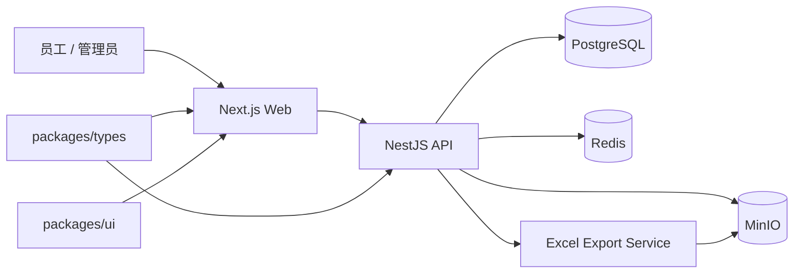
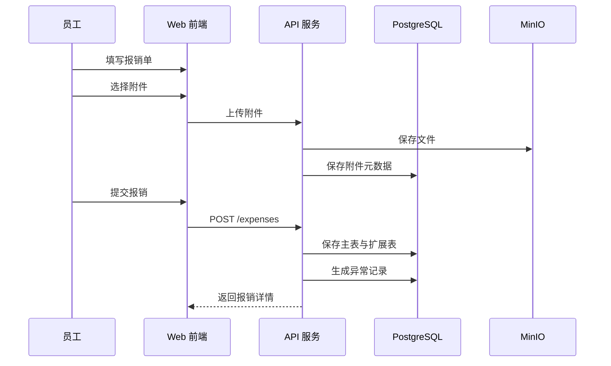

# 智能报账平台 Financial System

一个面向企业内部报销场景的 V1 平台，覆盖员工报销录入、附件上传、规则异常标记、管理端查看与配置、月度统计和 Excel 导出。

当前仓库已经实现一套可本地运行的 Monorepo：
- 员工端：提交普通报销、差旅报销、采购报销
- 管理端：查看报销、异常、分类、规则、统计、导出
- 后端：NestJS + Prisma + PostgreSQL 的业务 API
- 共享层：前后端共用类型、枚举、Zod 校验 schema

## 技术栈

- Web: `Next.js 15` + `React 19` + `TypeScript`
- API: `NestJS` + `Prisma`
- Database: `PostgreSQL`
- Cache / job state: `Redis`
- Object storage: `MinIO`
- Validation: `Zod`
- Form: `react-hook-form`
- Data fetching: `@tanstack/react-query`
- Export: `exceljs`

## 核心能力

- 员工注册、登录、鉴权
- 普通报销、差旅报销、采购报销三类单据录入
- 先上传附件，再绑定报销单
- 规则异常检测，但不阻断提交
- 管理端按提交时间查看报销与异常
- 分类、采购分类、限额规则维护（支持编辑与启停）
- 月度统计与 Excel 导出（报销明细支持发票预览）

## 系统架构



### 分层说明

- `apps/web`
  员工端和管理端页面，负责表单交互、列表展示、登录态管理、文件下载。
- `apps/api`
  业务接口层，负责鉴权、报销创建、规则检测、统计聚合、导出生成。
- `prisma`
  数据模型、迁移脚本、初始化种子数据。
- `packages/types`
  前后端共享的 DTO、枚举、标签和 Zod schema，避免字段漂移。
- `packages/ui`
  当前项目使用的基础 UI 组件封装。

## 报销提交流程



### 规则处理原则

- 报销提交成功与否，不由规则异常决定
- 规则只负责打标和记录异常
- 管理端基于异常记录做人工查看和后续处理

## 目录结构

```text
financial-system/
├─ apps/
│  ├─ api/                 # NestJS API
│  └─ web/                 # Next.js Web
├─ packages/
│  ├─ config/              # 共享 tsconfig
│  ├─ types/               # 共享类型与校验
│  └─ ui/                  # 基础 UI 组件
├─ prisma/                 # Prisma schema / migration / seed
├─ docker-compose.yml      # postgres / redis / minio
├─ package.json            # workspace scripts
└─ pnpm-workspace.yaml
```

## 数据模型概览

核心业务对象包括：
- `users` / `roles` / `user_roles`
- `expense_categories`
- `purchase_categories`
- `expense_reports`
- `expense_normal_details`
- `expense_travel_details`
- `expense_purchase_details`
- `attachments`
- `limit_rules`
- `expense_anomalies`
- `export_jobs`

其中 `expense_reports` 是主表，不同类型的扩展字段拆到独立扩展表，便于：
- 保持主表稳定
- 降低空字段密度
- 后续扩展新的报销类型

## 主要接口

### 认证

- `POST /auth/register`
- `POST /auth/login`
- `GET /auth/me`
- `POST /admin/users/:id/reset-password`

### 报销

- `POST /expenses`
- `GET /expenses/my`
- `GET /expenses/:id`
- `GET /admin/expenses`

### 附件

- `POST /attachments/upload`
- `POST /expenses/:id/attachments`
- `GET /expenses/:id/attachments`

### 管理配置

- `GET/POST/PATCH /expense-categories`
- `GET/POST/PATCH /purchase-categories`
- `GET/POST/PATCH /rules`

### 统计与导出

- `GET /admin/anomalies`
- `GET /admin/stats/overview`
- `GET /admin/stats/by-category`
- `GET /admin/stats/by-employee`
- `GET /admin/stats/by-purchase-category`
- `POST /admin/exports/monthly`
- `GET /admin/exports/:id`
- `GET /admin/exports/:id/download`

## 本地启动

### 1. 安装依赖

```bash
npm install
```

### 2. 准备环境变量

```bash
cp .env.example .env
```

### 3. 启动依赖服务

```bash
docker compose up -d
```

如果你当前本地是用 Conda 里的 PostgreSQL，也可以按已有方式单独启动数据库。

### 4. 初始化 Prisma

```bash
npm run prisma:generate
npm run prisma:migrate
npm run prisma:seed
```

### 5. 启动项目

根据你本地脚本配置分别启动 Web 和 API。

当前联调默认地址：
- Web: `http://127.0.0.1:3000`
- API: `http://localhost:3001`

## 默认账号

种子数据默认包含：
- 管理员：`admin / Admin1234`
- 员工：`employee / Employee1234`

如果你改过 seed 或本地库，这两个账号可能已经变化。

## 开发说明

### 前端约束

- 业务页面集中在 `apps/web/app`
- 共享请求逻辑在 `apps/web/lib/api.ts`
- 主要业务表单在 `apps/web/components/expense-form.tsx`

### 后端约束

- 控制器负责入参接收和鉴权
- Service 负责业务逻辑和 Prisma 调用
- Zod schema 与 DTO 保持和 `packages/types` 一致

### 导出设计

导出不是同步大文件下载，而是任务模型：
- 创建导出任务
- 后端生成 Excel
- 文件上传到对象存储
- 前端下载生成结果

这种方式后续更容易扩展成异步队列和大批量导出。

## 测试与校验

已接入的基础命令：

```bash
npm run typecheck
npm run test
npm run build
```

建议在提交前至少执行：
- `npm run typecheck`
- `npm run test`
- `npm run build`

## 后续可扩展方向

- 审批流
- OCR 发票识别
- 重复发票检测
- 更细粒度的权限模型
- 导出任务队列化
- 更完整的附件预览和审计日志

## 仓库说明

这是一个以业务落地为目标的 V1 实现，当前重点是：
- 跑通员工报销到管理查看的完整链路
- 保持前后端共享类型一致
- 为后续审批、财务闭环、自动识别预留结构

如果你准备继续演进这个项目，建议优先处理：
1. 管理端 UI 统一和交互细化
2. 规则引擎抽象
3. 导出与附件的异步任务化
4. 更完整的 E2E 回归测试

## 最新变更（2026-04-07）

### 管理端配置项支持编辑与停用

- 页面：`/admin/categories/expense`、`/admin/categories/purchase`、`/admin/rules`
- 能力：新增行级编辑、状态展示（启用中/已停用）、启停开关
- 约束：不支持删除，停用仅修改 `enabled=false`
- 字段锁定：分类 `code` / `extensionType` 不可编辑，规则关联分类在编辑态锁定

### 员工端新建报销隐藏停用项

- 员工端创建报销时，分类和采购分类仅展示 `enabled=true` 项。

### Excel 导出支持发票预览

- “报销明细”sheet 新增 `发票预览` 列。
- 图片发票直接嵌入。
- PDF 发票按页转图片后嵌入。
- 预览图可点击，跳转后端稳定附件访问地址（不暴露存储层 URL）。
- PDF 转图失败不阻断导出，自动降级为可点击文本链接。

### PDF 转图依赖

导出 PDF 发票预览依赖 Python + PyMuPDF：

```bash
pip install pymupdf
```

脚本路径：`apps/api/scripts/pdf_to_png.py`

更多细节见变更日志：`docs/change-log.md`

## 当前实现补充

### 管理端配置维护

- 报销分类、采购分类、规则管理 已支持编辑与启用/停用。
- 当前版本不支持物理删除，目的是避免历史报销、统计和导出断链。
- 员工端新建报销默认只显示 enabled = true 的分类与采购分类。

### Excel 发票预览

- 报销明细 sheet 新增 发票预览 列。
- 图片发票直接嵌入表格，并绑定系统稳定附件访问链接。
- PDF 发票会先转成图片，再按页嵌入表格；如果转图失败，会自动降级为可点击文本链接。
- 预览图采用固定尺寸和留白布局，优先保证整张表格可读性。
